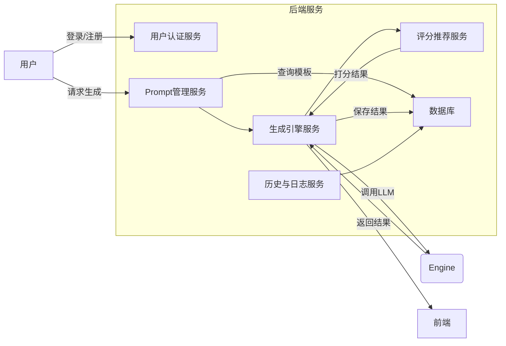
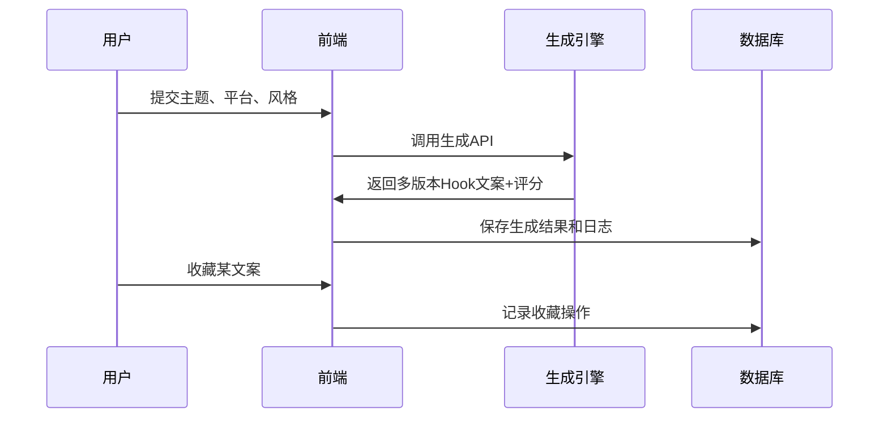

# 执行摘要  
针对短视频与图文创作者在内容制作中遇到的“开头3秒吸引力不足、平台语气难迁移、灵感难复用”痛点，本文提出了一套完整的AI Hook生成平台设计方案。系统核心路径包括：主题输入→平台选择→多版Hook生成→评分与推荐→收藏复用→历史记录等模块。设计结构化Prompt模板，以平台、主题、用户画像、情绪风格、字数等为输入变量，输出Hook文案、风格标签、点击欲望评分及推荐理由，提高生成结果可解释性。建立评分体系和评估指标（如生成完成率、收藏率、采用率、平台适配满意度、可解释性评分等）并定义计算方法。后端采用微服务架构设计（或可选单体架构），包含提示词管理服务、生成引擎、评分服务、审计日志等，数据库表设计涵盖用户、Prompt模板、生成结果、收藏历史、Bad Case等实体。前端设计包含输入页、生成结果页、收藏库、历史与评测页、后台管理等，每页流程清晰；**图1**展示了前端设计示例。构建小型评测集（20个主题，三平台风格），进行人工评分和Bad Case分类，统计可用率与主要问题。后续迭代通过增加Prompt约束、示例补充、输出格式限制及A/B测试不断优化。部署方面考虑并发控制、缓存、限流和用户隐私脱敏。下文详细阐述各部分方案，包括示例数据、API设计、里程碑和风险应对措施。

## 目标用户与痛点  
- **目标用户**：短视频和图文（如小红书笔记、抖音短视频、B站视频等）内容创作者，包括个人博主、MCN机构等。初期假设用户规模约1000人。  
- **用户痛点**：  
  - **开头3秒吸引力不足**：短视频业界普遍强调“黄金3秒法则”，开头三秒必须抓住观众兴趣，否则易被刷过。不少创作者缺乏高效生成吸睛开头文案的工具。  
  - **平台语气难迁移**：不同平台调性差异大，如抖音偏娱乐、文案要求“短平快+情绪冲击”，小红书注重“干货+网感表达”。内容复用时需要手动改写效率低且易偏离风格。  
  - **灵感难复用**：创作者常积累灵感片段，但缺乏沉淀机制，创作成一次性产出工具，难以积累创作资产。需要将生成的文案经过收藏和分类，形成可复用资产库。  
  - **其他需求**：希望输出可比较、可解释的多版本文案，便于从中选择最优方案，提高内容产出效率。  

## 产品核心路径与功能模块  
系统核心路径依次为：**主题输入 → 平台选择 → 多版Hook生成 → 评分推荐 → 收藏复用 → 历史记录 → 用户反馈**。对应功能模块包括：  

- **主题输入**：用户输入内容主题和素材（关键词、标题草稿等），辅助填写目标用户画像（年龄、兴趣）、情绪风格（如幽默、正式）和字数限制。  
- **平台选择**：提供小红书、抖音、B站等风格选项，不同平台可配置不同语调和表达重点。例如抖音偏“爆点制造”，小红书重“实用引导”。  
- **多版Hook生成**：后端调用大模型（如GPT-4V、国产大模型等）生成多个版本的Hook文案；每个版本带有风格标签和Click诱导元素。  
- **评分推荐**：对生成结果进行自动评分和排序。评分包括“点击欲望评分” (0–100分) 和可解释性推荐理由。系统可基于评分高低、风格多样性自动推荐最优方案。  
- **收藏与复用**：用户可以对满意的Hook进行收藏，收藏库作为创作资产库供后续复用。用户可对收藏内容进行分类、标注标签，方便检索。  
- **历史记录**：记录每次生成请求、输入参数、输出结果、用户操作（采纳/删除/评分）等，用于分析和模型审计。  
- **评测集管理与Bad-case库**：系统提供“评测集管理”功能，存储针对20个主题×3平台风格的人工评分数据及常见失败样例(Bad Case)库，用于诊断和改进模型表现。  
- **用户反馈**：页面提供用户反馈入口，可对生成质量、评分准确度进行评价，形成闭环改进。  

具体功能模块如表格**后端数据模型**和**前端页面矩阵**所示（见后文表格部分）。

## 结构化 Prompt 模板设计  
设计结构化Prompt模板以提升生成稳定性和可解释性。输入变量和输出要求定义如下：  

- **输入变量**：  
  - **平台**：小红书/抖音/B站等，决定语调和格式要求。  
  - **内容主题**：创作主题关键词（如“健身减肥日常”）。  
  - **目标用户画像**：年龄、性别、兴趣等简要描述，用于定制化文案风格（如面向**Z世代女生**）。  
  - **情绪风格**：如“幽默调侃”、“悬疑引导”、“青春活力”等，用以调整词汇和口吻。  
  - **字数限制**：Hook字符或字数长度范围。  
  - **示例上下文**：可选输入例如相关开头案例或参考文案，引导模型输出类似风格。  

- **输出格式**：要求模型返回结构化字段，如：  
  1. **Hook 文案**（字符串）：满足平台规则和以上输入条件的开头句/短文案。  
  2. **风格标签**（单词或短语）：简要描述文案风格（如“幽默”/“悬念”）。  
  3. **点击欲望评分**（0–100 分）：模型估算的用户点击或阅读意愿分数。  
  4. **推荐理由**（字符串）：解释为何推荐该文案（如“设置悬念吸引好奇心”），增加可解释性。  

设计时可采用Prompt工程框架，例如使用Aliyun百炼文档提到的IC-IO（Instruction, Context, Input, Output）结构。例如：  

```
指令：请为主题“秋季护肤技巧”生成适合小红书平台的三个短Hook开头，每个不超过15字。
背景：目标用户为25-35岁女性，喜欢护肤和美妆。风格可幽默或悬念引导。
输入样例：。
输出格式：列出每个Hook文案、风格标签、点击评分（0-100）和推荐理由。
```  

通过结构化Prompt模板，将输入变量化与输出格式化，可复用性更强，也便于后续迭代优化。  

## 评分体系与评估指标  
为评估生成效果与产品指标，设定以下评分体系和关键指标：  

- **生成完成率**：指生成API返回有效结果的比例。计算方法：完成率 = (成功生成请求数 / 总请求数)×100%。目标设定如≥95%。  
- **收藏率**：指用户从生成结果中收藏（标记为有用）的Hook占比。计算：收藏率 = (被收藏文案数 / 总生成文案数)×100%。较高收藏率表明生成内容实用性好。  
- **采用率**：指实际被用户使用/发布（或标为“采用”）的Hook占比，用于衡量生成输出的实用程度。计算：采用率 = (被采用文案数 / 总生成文案数)×100%。可通过用户确认采纳触发。  
- **平台适配满意度**：用户对不同平台风格适配度的主观评分（1-5分），通过用户问卷或后续反馈收集，计算平均分。此指标反映生成文案是否符合目标平台调性。  
- **可解释性评分**：评估生成结果附带的推荐理由和标签是否有助于理解和决策。可通过用户标注质量或专家评审打分获得（例如1-5分）。  
- **完播率/参与度**（非产品指标，可与创作者合作获得）：如用户实际发布后，与Hook对应短视频的完播率、点赞收藏率等，作为外部验证指标。  

评估过程中可设置阈值示例：如收藏率>20%、采用率>10%，平台适配满意度>4.0分等。如达不到目标，可迭代优化Prompt和模型参数。Bad Case库的分类也为优化提供方向（例如常见问题：标题过泛、语言不符合平台等）。  

## 后端架构与数据模型  
后端可采用**微服务架构**以提高可扩展性和灵活性：将功能拆分为多服务，如用户认证、Prompt管理、生成引擎、评分系统、数据存储等。如业务规模不大，也可选用单体架构快速上线。关键服务和数据流程如下：  



- **API设计**：后端暴露RESTful API。如表格所示（见后文），包括用户注册登录（/api/auth）、生成Hook请求（/api/generate）、收藏操作（/api/collect）、历史查询（/api/history）、Bad Case反馈（/api/badcase）等。每个接口定义请求参数和示例JSON请求/响应。  
- **Prompt版本管理**：为了可控迭代，应为Prompt模板和大模型调用策略维护版本号。设计PromptTemplate表记录template_id、平台、目标、输入范例、版本号等，以便回溯和多版本比较。  
- **数据库表结构示例**（见下表）：主要表包括：  
  - **Users**：用户信息（id, 用户名, 密码Hash, 注册时间等）。  
  - **PromptTemplates**：存储结构化Prompt模版（id, 平台, 主题, 角色描述, 输入约束, 版本, 更新时间等）。  
  - **GeneratedHooks**：保存生成结果（id, user_id, prompt_id, 平台, 文案内容, 风格标签, 评分, 推荐理由, 生成时间等）。  
  - **Collections**：用户收藏记录（id, user_id, generated_hook_id, 收藏时间）。  
  - **History**：用户操作历史（id, user_id, 操作类型, 相关id, 时间戳）。  
  - **BadCases**：收集的失败案例（id, platform, input_context, output_hook, 问题类型, 说明）。  
  - **EvaluationSets**：小型评测集条目（id, 主题, 平台, 生成结果, 人工评分, 备注）。  

| 表名               | 字段                         | 类型         | 描述                 |
| ------------------ | ---------------------------- | ------------ | -------------------- |
| **Users**          | id (PK)                      | INT(11)      | 用户ID               |
|                    | username                     | VARCHAR(50)  | 用户名               |
|                    | password_hash                | VARCHAR(255) | 密码哈希             |
|                    | created_at                   | DATETIME     | 注册时间             |
| **PromptTemplates**| id (PK)                      | INT(11)      | 模板ID               |
|                    | platform                     | VARCHAR(20)  | 平台类别（如抖音）   |
|                    | title                        | VARCHAR(100) | 模板标题/描述        |
|                    | instructions (JSON/Text)     | TEXT         | 指令和框架输入定义   |
|                    | example_input (JSON/Text)    | TEXT         | 示例输入             |
|                    | output_format (JSON/Text)    | TEXT         | 输出格式要求         |
|                    | version                      | VARCHAR(10)  | 版本号               |
|                    | updated_at                   | DATETIME     | 更新时间             |
| **GeneratedHooks** | id (PK)                      | INT(11)      | 文案ID               |
|                    | user_id (FK)                 | INT(11)      | 生成用户             |
|                    | prompt_id (FK)               | INT(11)      | 使用的Prompt模板ID   |
|                    | platform                     | VARCHAR(20)  | 内容平台             |
|                    | content                      | TEXT         | Hook文案内容         |
|                    | style_label                  | VARCHAR(50)  | 风格标签             |
|                    | click_score                  | INT          | 点击欲望评分(0-100)  |
|                    | reason                       | TEXT         | 推荐理由             |
|                    | created_at                   | DATETIME     | 生成时间             |
| **Collections**    | id (PK)                      | INT(11)      | 收藏记录ID           |
|                    | user_id (FK)                 | INT(11)      | 用户ID               |
|                    | hook_id (FK)                 | INT(11)      | Hook文案ID           |
|                    | collected_at                 | DATETIME     | 收藏时间             |
| **History**        | id (PK)                      | INT(11)      | 历史记录ID           |
|                    | user_id (FK)                 | INT(11)      | 用户ID               |
|                    | action_type                  | VARCHAR(20)  | 操作类型（生成/收藏/删除）|
|                    | reference_id                 | INT(11)      | 相关对象ID（如hook_id） |
|                    | timestamp                    | DATETIME     | 操作时间             |
| **BadCases**       | id (PK)                      | INT(11)      | 案例ID               |
|                    | platform                     | VARCHAR(20)  | 平台                 |
|                    | input_context                | TEXT         | 输入描述/示例        |
|                    | output_hook                  | TEXT         | 生成的失败文案       |
|                    | issue_type                   | VARCHAR(50)  | 问题类型标签         |
|                    | description                  | TEXT         | 问题描述             |
| **EvaluationSets** | id (PK)                      | INT(11)      | 评测条目ID           |
|                    | topic                        | VARCHAR(100) | 评测主题             |
|                    | platform                     | VARCHAR(20)  | 平台                 |
|                    | generated_hook               | TEXT         | 生成的Hook           |
|                    | manual_score                 | INT          | 人工评分             |
|                    | notes                        | TEXT         | 备注（如失败原因）   |

以上示例表结构可根据实际需要扩展，字段类型可根据数据库（MySQL、PostgreSQL等）调整。

## 前端设计与交互流程  
前端设计需简洁直观，典型页面包括：输入页、生成结果页、收藏库、历史与评测页、管理后台。以下页面矩阵示例：  

| 页面             | 主要功能                                 | 关键交互                                           |
| ---------------- | ---------------------------------------- | -------------------------------------------------- |
| **输入页**       | 输入主题、选择平台、填写用户画像和风格    | 输入框、下拉选择；提交后跳转生成结果页               |
| **生成结果页**   | 展示多版Hook文案、风格、评分和推荐理由    | 文案可复制/分享；可对单条文案点赞、收藏或标记改进需求 |
| **收藏库**       | 查看已收藏的文案列表，并按标签筛选/管理   | 删除/编辑收藏；可再次生成相似风格文案                |
| **历史与评测页** | 查看历史生成记录和评测结果                | 搜索历史记录；查看Bad Case示例和人工评测详情         |
| **管理后台**     | 管理Prompt模板版本、查看统计指标和BadCase | 模板增删改查；系统日志及异常监控                     |

用户交互流程示例如下：  
1. **用户登录→输入页**：填写主题、选择平台（如抖音）、设定风格→点击“生成”触发API请求。  
2. **生成结果页**：显示各版本Hook列表（含风格标签和“点击欲望评分”）。用户可立即复制、分享到应用，也可通过**收藏**图标将优秀结果保存到收藏库，或标记反馈。  
3. **收藏库**：用户可查看自己所有收藏的文案，并进行编辑和重用。  
4. **历史与评测**：查看之前所有生成记录，包含输入参数、输出文案及用户操作记录。评测集条目和Bad Case样例也在此供参考。  
5. **用户反馈与管理**：用户可对不合理的评分结果或生成内容提交反馈，系统管理员通过后台页面监控指标、调整Prompt策略。  

 *图1：前端页面原型示意（用户绘制的功能流程图示例）*  

此外，可用Mermaid图描述前后端交互：  



## 小型评测集设计与实验流程  
构建小型评测集验证效果：  
1. **选题**：选取20个具有代表性且多样的创作主题（如美妆、健身、美食、科技、教育等）。  
2. **跨平台生成**：针对每个主题，在小红书、抖音、B站三种风格下生成Hook文案。  
3. **人工评分模板**：设计评分表格，包括维度：*吸引力*、*平台契合度*、*语言质量*、*可解释性*等，每项1–5分，同时记录“是否采纳”、“采纳理由/建议”等。附带Bad Case分类项（如“语言泛化”、“平台不符”、“重复内容”等）。  
4. **实验流程**：  
   - 制定**人工评分表格**（见下文统计表格模板）。  
   - 几位内容领域专家或资深创作者独立评分，计算平均分及一致性。  
   - 统计指标：各平台生成结果总数、可用（通过阈值）数量、可用率及各评分项均值。  
   - **Bad Case分析**：统计输出失败案例（如文案过于生硬、未满足平台调性），归类总结典型问题及占比。  

例如，评测结果统计表模板可设计为：  

| 主题   | 平台   | 生成数 | 可用数 | 可用率(%) | 典型问题类型       |
| ------ | ------ | ------ | ------ | --------- | ------------------ |
| 美妆教程 | 小红书 | 50     | 35     | 70%       | 语言过于技术化     |
| 美妆教程 | 抖音   | 50     | 28     | 56%       | 缺乏情绪词、泛用句 |
| ...    | ...    | ...    | ...    | ...       | ...                |

该评测集使团队能够定量了解不同风格下的生成可用率和主要缺陷，指导后续Prompt优化。

## 迭代策略与Prompt优化方法  
基于评测反馈和Bad Case，采用以下迭代方案：  
- **示例约束**：在Prompt中加入正反面示例，引导模型避开常见错误。如Bad Case中发现“标题过泛”，则示例中强调具体化内容。  
- **示例补充**：增加更多上下文示例，帮助模型学习平台口吻差异。例如给出小红书爆款笔记开头示例。  
- **输出格式限制**：通过明确模板要求（如“必须以疑问句或感叹句开头”）降低不符合期望的输出。  
- **A/B测试**：对关键Prompt变量（如不同指令用词、示例种类）进行A/B测试。随机分配用户流量收集效果差异数据，以选择最佳Prompt方案。  
- **版本管理**：每次迭代更新Prompt模板版本，并记录对照测试结果。较好版本正式上线，差版本存档。  

通过持续优化Prompt和必要时微调模型，可逐步提升生成质量和用户指标。

## 部署、性能、安全与隐私考虑  
- **部署**：可采用云服务（如AWS/Aliyun/GCP）部署后端微服务，前端可用React/Vue等框架实现SPA。建议使用Docker容器和Kubernetes编排，方便扩展。  
- **并发与缓存**：预测初期并发用户量（如1000活跃用户，每日生成请求峰值）。设计生成请求队列和可缓存的Prompt-结果映射（如同一输入重复利用缓存），减少LLM调用成本。常用热点Prompt可预热结果。  
- **速率限制**：对生成API设限流（如每用户每分钟请求次数上限），防止滥用。  
- **安全**：鉴权使用Token（OAuth2/JWT）机制。后台监控接口访问，防止恶意接口调用。  
- **隐私**：用户数据（如Prompt输入）需要脱敏存储。如用户提供含个人信息的输入，应对敏感信息进行屏蔽或哈希存储。系统日志避免记录明文敏感内容。确保符合相关平台规范和法律要求。  
- **合规**：按照国家《生成式人工智能内容标识办法》，要求对AI生成内容进行显性标识。系统可在生成Hook旁自动添加“（AI生成）”标签提醒创作者。  

## 示例数据与API示例  
以下提供部分接口示例和JSON请求/响应格式：  

```
POST /api/generate
请求:
{
  "user_id": 123,
  "platform": "douyin",
  "topic": "健身减肥",
  "user_profile": "25-30岁女性，健身初学者",
  "tone": "幽默活泼",
  "length_limit": 20
}
响应:
{
  "status": "success",
  "results": [
    {
      "hook": "3分钟暴汗！我竟然瘦了5斤…",
      "style": "悬念",
      "score": 89,
      "reason": "设置冲突点引发好奇"
    },
    { ... },
    { ... }
  ]
}
```  

```
POST /api/collect
请求:
{
  "user_id": 123,
  "hook_id": 456
}
响应:
{
  "status": "success",
  "message": "已收藏"
}
```  

API列表（示例）：

| 接口                  | 方法 | 描述               | 请求示例                         | 响应示例                 |
| --------------------- | ---- | ------------------ | -------------------------------- | ------------------------ |
| `/api/auth/register`  | POST | 用户注册           | `{username,password}`            | `{status,msg}`           |
| `/api/auth/login`     | POST | 用户登录           | `{username,password}`            | `{status,token}`         |
| `/api/generate`       | POST | 生成Hook文案       | 如上示例                         | 如上示例                 |
| `/api/collect`        | POST | 收藏文案           | `{user_id,hook_id}`              | `{status,msg}`           |
| `/api/history/list`   | GET  | 获取历史记录       | `?user_id=123`                   | `{history:[...]} `       |
| `/api/template/list`  | GET  | 列出Prompt模板     | `?platform=xhs`                  | `{templates:[...]} `     |
| `/api/badcase/report` | POST | 提交BadCase反馈    | `{platform,input,output,issue}`  | `{status}`               |

## 时间表与里程碑  
假设项目开发团队配置如下：2名前端工程师、2名后端工程师、1名产品经理、1名测试工程师、1名AI研发（Prompt专家）兼DevOps支持。典型里程碑：  

- **需求与设计阶段**（1个月）：产品经理细化需求，UI/UX设计稿，确定技术选型（如后端框架、LLM服务）。  
- **后端开发**（2个月）：实现用户系统、Prompt管理、生成与评分服务、数据库模型和API。并行开发生成模块（集成模型API）和评分模块（打分规则实现）。  
- **前端开发**（2个月）：实现输入/结果/收藏/历史/管理等页面，与后端联调接口。重点是交互流程和页面状态管理。  
- **测试阶段**（1个月）：功能测试、接口测试、性能测试。进行小型内部评测集试运行，收集数据修正问题。  
- **上线与发布**：部署到生产环境，逐步邀请内测用户试用，观察指标。  
- **评测与优化**：根据用户反馈和评测集结果迭代Prompt和模型策略。  

建议人力分配为：每个阶段团队保持以上配置，全职投入。整体预计3–4个月完成初版。  

## 风险与应对措施  
- **生成质量不足**：Hook不够吸引或偏离风格。*应对*：及时收集Bad Case，优化Prompt和示例，调整模型参数；设立人工审核或过滤机制。  
- **模型输出偏见或不当内容**：有可能生成低俗或违规内容。*应对*：可设置敏感词过滤，严格遵守平台安全规范。对模型进行微调或采用服务商的内容审核API。  
- **技术性能瓶颈**：LLM调用耗时高、并发差。*应对*：使用推理服务器加速（如GPU实例），引入缓存，必要时降级为简易逻辑输出，保证系统响应。  
- **用户增长不可控**：超过预期用户量。*应对*：云资源弹性扩容；收费化或限制免费使用额度控制负载。  
- **法律合规风险**：AI生成内容标识要求。*应对*：前文所述显式标记AI生成（参见），提供删除元数据功能，不鼓励滥用技术生成虚假信息。  
- **项目进度延误**：技术难题或人力不够。*应对*：敏捷开发，设置周会跟踪进度；采用成熟开源库和模型，避免重复造轮子。  

> *备注：各设计和方案参考了行业最佳实践和平台规范，例如抖音平台AI内容管理问答，人民网报道的AI内容标识办法，以及阿里云和产业报告中关于结构化Prompt和可解释性要求等指导（分别见）。以上示例数值和人员配置仅供参考，可根据实际资源和业务需求调整。*

