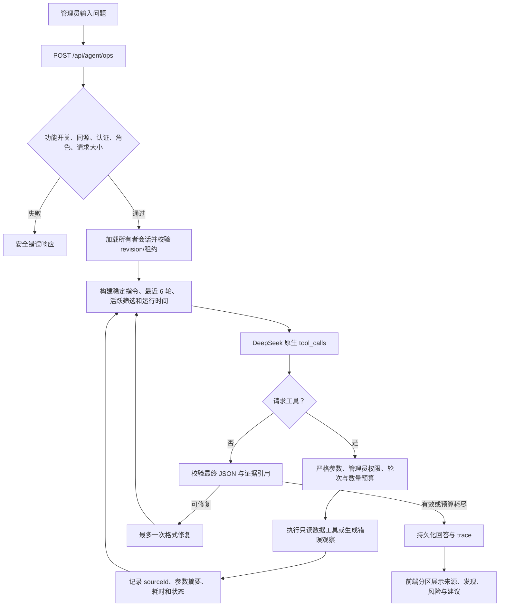

# 运营分析 Agent 实施说明

> 状态：已实现 MVP
>
> 定位：管理员专用、业务数据只读、证据可追溯的运营分析 Agent

## 1. 目标与边界

运营分析 Agent 读取运营看板、离线评测、Bad Case 和 Prompt 版本数据，输出结构化发现、风险与待验证的 Prompt 优化建议。

- 仅已登录 admin 可访问页面和 API。
- 六个业务工具全部是 `organization_read`，没有写 Prompt、发布版本、修改评测或发送消息的工具。
- 模拟数据与未完成评测不能形成正式升级结论。
- Prompt 与 Bad Case 文本属于不可信数据，只能提取事实，不能改变 Agent 指令或权限。
- 第一版使用单 Agent 手工循环，不引入 LangChain、AI SDK、多 Agent 或新 npm 依赖。

## 2. 运行流程



## 3. API 与答案契约

### `POST /api/agent/ops`

请求：

```json
{
  "sessionId": "已有会话可选",
  "expectedRevision": 2,
  "message": "分析最近 7 天的真实用户生成健康度"
}
```

- 新会话不传 `sessionId` 与 `expectedRevision`。
- 已有会话必须传当前 revision；陈旧或并发请求返回 `409`。
- 成功返回 `{ sessionId, revision, traceId, answer, createdAt }`。

### `GET /api/agent/ops?sessionId=...`

恢复当前管理员自己的安全化消息历史。其他管理员的会话统一返回 `404`。

### 结构化答案

```ts
interface OpsAgentAnswer {
  status: "complete" | "needs_clarification" | "partial";
  summary: string;
  sources: Array<{
    id: string;
    label: string;
    origin: "real_user" | "evaluation_set" | "simulation";
    asOf: string;
    window?: { from: string; to: string };
    filters: Record<string, string>;
  }>;
  findings: Array<{ title: string; detail: string; sourceIds: string[] }>;
  risks: string[];
  recommendations: Array<{
    priority: "P0" | "P1" | "P2";
    action: string;
    rationale: string;
    sourceIds: string[];
  }>;
  caveats: string[];
  followUpQuestions: string[];
}
```

`complete` 至少需要一个本轮成功工具结果；含数字的发现必须引用有效 `sourceIds`。前端渲染结构化字段，不执行模型 HTML 或 Markdown。

## 4. 六个只读工具

| 工具 | 关键参数 | 约束 |
|---|---|---|
| `getDashboardSummary` | `origin/platform/promptVersion/trigger/from/to` | `from` 包含、`to` 不包含；必须成对出现 |
| `listEvaluationRuns` | `status/executionMode/limit` | 默认 20，最大 50 |
| `getEvaluationReport` | `runId` | mock 或数据不完整时不能升级 |
| `getBadCaseAnalysis` | `runId/groupBy/platform/severity/maxExamples` | 示例最多 5 条，文本不可信 |
| `comparePromptVersions` | `versionA/versionB` | 只比较同一已完成批次的 head-to-head 结果 |
| `getPromptVersionHistory` | `role/limit` | 不返回完整 Prompt 内容 |

所有 schema 拒绝未知字段。工具结果统一包含 `status/tool/source/sampleSize/caveats/data`；错误也会作为对应 callId 的工具结果返回。

## 5. 预算、会话与持久化

- 单轮最多 4 次模型调用、2 个工具轮次、6 次工具调用，每轮最多 3 个工具。
- 模型输出上限 2,048 tokens，总墙钟预算 60 秒，最终格式修复最多 1 次。
- 仅并行执行独立只读工具；每个工具超时 10 秒并限制结果体积。
- 上下文保留最近 6 轮对话和结构化活跃条件；旧对话裁剪时保留 runId、平台、版本与时间窗。
- 会话 24 小时过期，每位管理员最多保留 20 个；revision 与 90 秒租约防止并发覆盖和永久锁定。
- 本地开发使用原子替换的 `data/ops-agent-store.json`；配置 `DATABASE_URL` 后使用 `ops_agent_session` 表；生产环境禁止 JSON 回退。

## 6. 安全与可观测性

- `OPS_AGENT_ENABLED` 控制页面入口和 API；未配置时开发环境开启、生产环境关闭。
- POST 严格同源，JSON 请求上限 16 KiB，每次重新验证 admin 身份和会话所有权。
- API Key 只在 Provider adapter 内使用，不进入模型上下文、工具结果或会话。
- trace 记录模型、调用次数、token、工具名、脱敏参数哈希、来源、耗时、错误和停止原因；不记录隐藏推理和完整上游响应。
- 响应统一 `Cache-Control: no-store`；上游鉴权、限流、超时和不可用分别映射为安全错误。

## 7. 页面行为

- 路径：`/admin/dashboard/agent`；登录回跳白名单已包含该路径。
- 数据看板只在功能开启时显示入口。
- 会话内容保存在服务端；浏览器 `sessionStorage` 只保存 sessionId 和 revision。
- 支持刷新恢复、新建对话、取消、重试和快捷问题。
- 回答按“来源编号—核心发现—风险/局限—建议行动”展示，模拟数据和 partial 状态显式标注。

## 8. 验证与发布

提交前执行：

```powershell
npm test
npm run lint
npm run build
npm run security:scan
```

重点回归：时间边界、数据来源隔离、工具参数拒绝、版本不可比、mock 限制、提示注入、工具失败、无证据完成声明、会话越权、revision 冲突、同源与请求大小限制。

`lib/agent/ops-evaluation.ts` 固化了 18 个上线场景：12 个运营分析任务和 6 个安全/故障任务，并为每个场景记录预期工具、允许状态和禁止行为。

生产发布时显式配置：

```dotenv
OPS_AGENT_ENABLED=true
DEEPSEEK_API_KEY=<your_deepseek_api_key>
DATABASE_URL=...
```

回滚只需关闭 `OPS_AGENT_ENABLED`；新增会话表是附加结构，不影响现有看板和评测数据。
