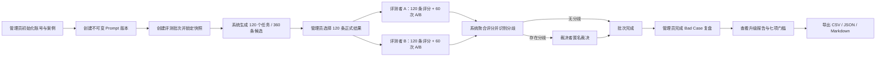
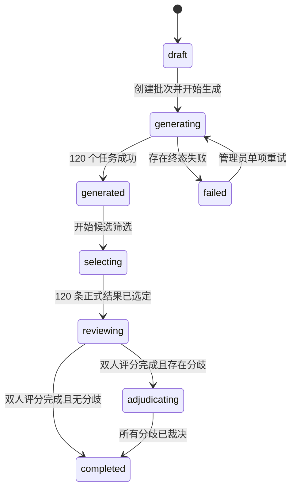

# AI Hook Lab 离线评测系统 PRD

> 文档版本：V1.0  
> 产品状态：已实现，可进入内部验收  
> 适用范围：AI Hook Lab Prompt 离线评测、版本升级决策与 Bad Case 复盘  
> 更新日期：2026 年 7 月 13 日  
> 文档负责人：产品 / AI 应用团队

## 0. 文档说明

本 PRD 定义 AI Hook Lab 离线评测系统的产品目标、角色权限、端到端业务流程、功能需求、指标口径、异常处理与验收标准。系统用于在固定输入、固定模型参数和匿名人工评审条件下，对 baseline Prompt 与 candidate Prompt 进行可复现比较，并输出 Prompt 是否值得升级的建议。

本系统只提供升级建议，不自动替换线上 Prompt；离线评分、人工意向和模拟数据均不得包装成真实用户点击、收藏、采用或传播效果。

### 0.1 版本记录

| 版本 | 日期 | 状态 | 说明 |
| --- | --- | --- | --- |
| V0.1 | 2026-07-13 | 需求草案 | 根据图一业务目标拆解评测范围与证据边界 |
| V0.9 | 2026-07-13 | 开发完成 | 完成 60 案例、双人盲评、裁决、报告与导出链路 |
| V1.0 | 2026-07-13 | 内部验收 | 补齐流程、权限、异常处理和验收口径 |

## 1. 产品背景

AI Hook Lab 已具备多平台 Hook 生成、收藏、采用标记和数据看板能力，但 Prompt 迭代过去主要依赖主观观察，存在以下问题：

- 输入样本不固定，无法确认差异来自 Prompt 还是主题变化。
- baseline 与 candidate 可能使用不同模型参数，造成混杂实验。
- 模型自评分容易与真人质量判断混淆。
- 单人评测容易受版本偏好影响，且缺少分歧裁决。
- Bad Case 只记录现象，未形成“根因 - 改进动作 - 下一版本”闭环。
- 模拟收藏或采用容易被误解为真实用户行为。

因此需要建立一个固定案例、批次快照、双人独立盲评、第三人裁决、升级门槛和可追溯导出的离线评测系统。

## 2. 产品目标与边界

### 2.1 产品目标

1. 建立 20 个主题 × 3 个平台，共 60 条固定评测案例。
2. 在相同案例快照、相同模型、相同参数下比较 baseline 与 candidate。
3. 每个 Prompt 每个案例生成 3 条候选，由管理员选择 1 条正式结果。
4. 由两名评测者独立完成 120 条正式结果评分和 60 次 A/B 盲评。
5. 对收藏/采用意向和 A/B 分歧进行第三人匿名裁决。
6. 输出整体、平台、Bad Case 和七项升级门槛报告。
7. 严格隔离真实用户、评测集和模拟事件来源。
8. 保留 Prompt、批次快照、原始响应、评分与裁决的完整审计证据。

### 2.2 成功标准

- 完整批次包含 60 个案例、120 个生成任务、360 条候选、120 条正式结果。
- 两名评测者共提交 240 条原始评分和 120 次原始 A/B 选择。
- 60 个 A/B 案例全部定案，所有意向分歧均完成裁决。
- 报告中的分母、完成度、模型参数、来源和执行模式清晰可见。
- Mock 或子集批次永远不会显示“建议升级”。
- 未知来源被拒绝，不得回退为真实用户来源。
- 五类 CSV、JSON 和 Markdown 共七个文件可导出且具备公式注入防护。

### 2.3 非目标

- 不预测真实点击率、播放量、收藏量或传播量。
- 不用模型自评分替代人工评审。
- 不提供公开注册、邮件找回或外部客户账号体系。
- 不自动覆盖、发布或回滚线上 Prompt。
- V1.0 不建设分布式任务队列、复杂 ORM 或自动扩缩容系统。
- V1.0 不把 Mock 评分作为正式产品决策证据。

## 3. 用户与角色权限

### 3.1 角色定义

| 角色 | 核心职责 | 可见内容 | 禁止操作 |
| --- | --- | --- | --- |
| 管理员 Admin | 账号、案例、Prompt、批次、生成、候选选择、报告和导出 | Prompt 版本映射、全部批次、生成证据、聚合结果 | 不参与本批次匿名评分与裁决 |
| 评测者 Evaluator | 完成自己的单条评分和 A/B 盲评 | 仅自己的待办、匿名方案 A/B、案例上下文 | 不查看 Prompt 版本映射、他人评分、报告结论 |
| 裁决者 Adjudicator | 处理两名评测者的意向和 A/B 分歧 | 匿名方案、分歧字段、必要案例上下文 | 不得兼任该批次主要评测者，不查看 Prompt 映射 |

### 3.2 权限原则

- 最小权限：用户只看到完成当前职责所需的信息。
- 评测隔离：评测者不可看到另一名评测者的评分。
- 版本盲化：评测和裁决页面不显示 baseline/candidate 标识。
- 职责分离：裁决者不得是同一任务的原始评测者。
- 审计留痕：账号、Prompt、批次、生成、评分、裁决和复盘均记录操作者与时间。

## 4. 核心名词与数据边界

| 名词 | 定义 |
| --- | --- |
| Dataset Version | 固定案例集合版本；V1.0 为 `hook-eval-v1` |
| Prompt Version | 不可变 Prompt 内容、变更摘要、建议模型和参数的版本记录 |
| Evaluation Run | 一次 baseline/candidate 对比批次，保存完整快照与状态 |
| Generation Task | 某案例 × 某 Prompt 版本的一次生成任务 |
| Candidate | 单个生成任务返回的 3 条备选 Hook 之一 |
| Formal Result | 管理员从 3 条候选中选择的正式评分对象 |
| Review Assignment | 评测者与案例的持久化 A/B 映射 |
| Adjudication | 对两人意向或 A/B 不一致的第三人裁决 |
| Bad Case | 与某条正式结果绑定的固定问题类型、严重度和备注 |

### 4.1 来源枚举

| 来源 | 标识 | 使用场景 |
| --- | --- | --- |
| 真实用户 | `real_user` | 创作台中的真实生成、收藏、复制和采用操作 |
| 离线评测 | `evaluation_set` | 固定案例生成、人工评分、A/B 和 Bad Case |
| 模拟事件 | `simulation` | 产品演示、自动化测试或模拟事件 |

旧来源 `real_operation`、`evaluation`、`simulated` 在迁移时分别映射为上述三个新值。客户端不得自由指定真实来源；未知来源必须直接拒绝。

## 5. 端到端业务流程

### 5.1 主流程

### 5.2 角色操作顺序

1. 管理员创建两名评测者和一名裁决者。
2. 管理员确认 baseline 与 candidate Prompt 版本。
3. 管理员选择执行模式、统一模型参数和完整数据集创建批次。
4. 系统立即写入案例、Prompt、模型和参数的不可变快照及内容哈希。
5. 管理员逐案例生成，或在页面中执行可恢复的全部生成。
6. 管理员完成每个案例、每个 Prompt 的候选选择。
7. 两名评测者分别登录，在互不可见条件下完成评分和 A/B。
8. 系统自动聚合数值评分，并为布尔意向或 A/B 不一致创建分歧任务。
9. 裁决者完成匿名裁决后，批次进入完成态。
10. 管理员补充 Bad Case 根因和改进动作，查看报告并导出。

### 5.3 批次状态流转

## 6. 数据集与平台规则

### 6.1 固定数据集

- 数据集由 20 个固定主题组成，每个主题覆盖小红书、抖音、B站。
- 同一主题三平台共用目标受众，平台规则决定表达基调和字数。
- 案例 ID 使用 `CASE_001_XHS`、`CASE_001_DY`、`CASE_001_BILI` 格式。
- 正式升级评测必须使用完整 60 案例；子集仅用于 Smoke Test。

### 6.2 平台规则

| 平台 | 字数限制 | 表达要求 | 典型风险 |
| --- | ---: | --- | --- |
| 小红书 | 60 字 | 生活化、经验表达、具体场景或避坑 | 过度权威、广告腔、缺少真实困扰 |
| 抖音 | 45 字 | 口语化、结果或冲突前置、节奏直接 | 铺垫过长、书面语、核心信息后置 |
| B站 | 70 字 | 问题或知识导向、机制解释、信息密度 | 纯情绪标题、缺少知识承诺 |

## 7. 功能需求

### 7.1 登录与账号管理

#### EVAL-AUTH-001 首个管理员初始化

- 当系统没有任何用户时，登录页提供首个管理员创建入口。
- 用户名仅允许字母、数字、点、下划线和连字符，长度 3–40。
- 密码至少 12 位；服务端使用 Node `crypto.scrypt` 加盐哈希。

#### EVAL-AUTH-002 会话安全

- 登录成功后生成随机会话令牌，服务端只保存 SHA-256 摘要。
- Cookie 必须为 HttpOnly、SameSite=Lax；生产环境启用 Secure。
- 会话有效期为 12 小时。
- 连续 5 次失败后锁定 15 分钟。

#### EVAL-AUTH-003 内部账号管理

- 管理员可以创建、停用、恢复和重置账号密码。
- 停用或重置密码时应使该账号已有会话失效。
- 系统不提供公开注册和邮件找回。

### 7.2 Prompt 版本管理

#### EVAL-PROMPT-001 创建版本

- 版本号格式为 `v1.2` 或 `v1.2.1`。
- 必填：名称、Prompt 内容、变更摘要、建议模型、建议参数。
- 保存后内容不可编辑；修改必须创建新版本。
- 系统计算并保存 Prompt 内容哈希。

#### EVAL-PROMPT-002 baseline 指针

- 管理员可以将某个历史版本设为当前 baseline 指针。
- 更新指针不得修改历史版本或历史批次快照。
- 系统永不根据报告自动更新 baseline。

### 7.3 批次创建

#### EVAL-RUN-001 创建条件

- 必须选择两名不同的主要评测者和一名裁决者。
- 裁决者不得与主要评测者重复。
- 必须选择不同的 baseline 和 candidate Prompt。
- 两个版本使用同一模型、温度、最大 token 和响应格式。
- Live 模式缺少 `DEEPSEEK_API_KEY` 时，创建操作必须失败。

#### EVAL-RUN-002 不可变快照

批次创建时保存以下快照：

- 案例内容、平台、受众、字数限制与数据集版本。
- baseline/candidate Prompt 全文、版本号和内容哈希。
- 模型名称、完整参数、执行模式和数据来源。
- 评测者、裁决者和持久化 A/B 映射。

### 7.4 批量生成

#### EVAL-GEN-001 任务规模

- 每个案例分别生成 baseline 和 candidate，共 120 个任务。
- 每个任务严格返回 3 条候选，共 360 条候选。
- 每次页面请求处理一个案例的两个版本，避免超时并支持恢复。

#### EVAL-GEN-002 校验与重试

- 校验 JSON、必填字段、候选数量、字数和重复内容。
- 保存原始响应、请求参数、尝试次数和错误类型。
- 格式或接口错误最多自动重试 2 次，即最多 3 次尝试。
- 重试耗尽后保存终态错误；管理员可显式执行单项重试。
- 页面刷新后从未完成任务继续，不重复成功任务。

#### EVAL-GEN-003 Mock 边界

- 无 API Key 时只能显式创建 Mock 批次。
- Mock 使用 `dataOrigin=evaluation_set` 与 `executionMode=mock` 双重标识。
- Mock 候选和理由必须明确说明其为流程模拟，不代表真实效果。
- Mock 报告永远返回“需要继续评测”。

### 7.5 候选筛选

#### EVAL-SELECT-001 正式结果

- 管理员在每个案例、每个 Prompt 的 3 条候选中选择 1 条。
- 完整批次形成 120 条正式结果。
- 模型自评分仅作为排序参考，不进入升级门槛。
- 任意正式结果开始人工评分后，管理员不得替换该结果。

### 7.6 单条匿名评分

#### EVAL-REVIEW-001 评分字段

每名评测者对 120 条正式结果分别填写：

- 人工可用性：1–5 分。
- 平台适配度：1–5 分。
- 开头吸引力：1–5 分。
- 推荐理由质量：1–5 分。
- 人工收藏意向：是 / 否。
- 人工采用意向：是 / 否。
- Bad Case 类型、严重度和备注，可选。

#### EVAL-REVIEW-002 匿名要求

- 页面只显示“方案 A / 方案 B”，不显示 Prompt 版本。
- A/B 映射使用安全随机数生成，并在批次创建时持久化。
- 刷新页面后映射不得变化。
- 评测者只能提交自己的任务，不能代替他人提交。

### 7.7 A/B 成对盲评

#### EVAL-PAIR-001 任务规则

- 每个案例展示该案例的两条正式结果。
- 评测者选择 A 更好、B 更好或两者相近，并填写比较原因。
- 每名评测者完成 60 次 A/B；两人共 120 次原始选择。
- 系统将盲选标签映射回真实 Prompt 角色后聚合。

### 7.8 分歧裁决

#### EVAL-ADJ-001 触发条件

- 两人的收藏意向不一致。
- 两人的采用意向不一致。
- 两人的 A/B 胜者不一致。
- 数值评分不进入裁决，直接取两人均值。

#### EVAL-ADJ-002 裁决内容

- 裁决页面显示匿名方案和存在分歧的字段。
- 裁决者填写最终布尔意向或最终 A/B 胜者。
- 裁决原因必填。
- 完成全部裁决后，系统重新计算批次状态。

### 7.9 Bad Case 复盘

#### EVAL-BAD-001 聚合规则

- Bad Case 按“正式结果 + 类型”去重。
- 同类型出现多个严重度时取最高值。
- 固定类型包括：内容过于宽泛、平台语气不匹配、与主题偏离、表达套路化、开头缺乏吸引力、推荐理由空泛、字数超限、候选重复、事实风险、表达不自然、格式错误和其他。

#### EVAL-BAD-002 管理员复盘

- 管理员为每条聚合 Bad Case 填写根因和改进动作。
- 根因回答“为什么当前 Prompt 会产生此问题”。
- 改进动作回答“下一版本 Prompt、案例或流程应如何调整”。
- 复盘记录进入导出文件并保留更新时间。

### 7.10 报告与升级判定

#### EVAL-REPORT-001 报告结构

- 批次元数据：版本、模型、参数、来源、执行模式、时间和完成度。
- 整体对比：可用率、平台适配率、收藏/采用意向率、吸引力和理由质量。
- 分平台对比：小红书、抖音、B站。
- A/B 结果：candidate 胜、baseline 胜、tie 和非平局胜率。
- Bad Case 对比：按类型、严重度和 Prompt 版本展示。
- 七项升级门槛：逐项显示阈值、实际值和是否通过。

#### EVAL-REPORT-002 完整性前置条件

只有同时满足以下条件才进入正式升级判断：

1. `executionMode=live`。
2. 完整覆盖 60 个案例。
3. 120 条正式结果全部完成双人聚合。
4. 60 次 A/B 全部定案。
5. 收藏和采用意向全部一致或已裁决。
6. 120 个生成任务均为成功终态。
7. 无终态缺失。

#### EVAL-REPORT-003 七项升级门槛

| 门槛 | 判断规则 |
| --- | --- |
| 可用率提升 | candidate 严格高于 baseline |
| 平台适配提升 | candidate 至少提高 8 个百分点 |
| A/B 胜率 | candidate 非平局胜率严格高于 55% |
| 高严重度 Bad Case | candidate 不得增加 |
| 平台退化 | 任一平台可用率下降不超过 5 个百分点 |
| 首次格式错误 | candidate 不高于 baseline |
| 字数超限 | candidate 正式结果超限数不高于 baseline |

- 全部通过：建议升级。
- 完整 Live 数据中任一失败：暂不升级。
- 数据不完整、子集或 Mock：需要继续评测。

### 7.11 导出

#### EVAL-EXPORT-001 文件清单

1. `evaluation_cases.csv`
2. `evaluation_generations.csv`
3. `human_evaluations.csv`
4. `pairwise_evaluations.csv`
5. `bad_cases.csv`
6. `evaluation_report.json`
7. `evaluation_report.md`

#### EVAL-EXPORT-002 安全与元数据

- CSV 使用 UTF-8 BOM，防止中文乱码。
- 以 `= + - @` 开头的单元格增加前置单引号，避免公式注入。
- 每个文件必须包含批次 ID、Prompt 版本、模型参数、来源和时间。
- 导出权限仅限管理员。

### 7.12 数据看板来源隔离

- Dashboard 默认只统计 `real_user`。
- `evaluation_set` 与 `simulation` 只能通过明确筛选单独查看。
- 文案分别使用“真实收藏率”“人工收藏意向率”“模拟收藏事件”。
- 模型自评分不得命名为真实点击率或真实收藏率。

## 8. 页面与信息架构

| 页面 | 路径 | 角色 | 核心任务 |
| --- | --- | --- | --- |
| 登录 / 初始化 | `/evaluation/login` | 全部 | 创建首个管理员或登录 |
| 评测概览 | `/evaluation` | 全部 | 根据角色查看账号、Prompt、批次和待办 |
| 批次详情 | `/evaluation/runs/[runId]` | 全部 | 生成、筛选、评分、盲评、裁决或复盘 |
| 升级报告 | 批次详情内报告区域 | Admin | 查看指标、门槛和升级建议 |
| 导出接口 | `/api/evaluation/runs/[runId]/export` | Admin | 下载七类结果文件 |

### 8.1 管理员首页

- 展示固定案例、候选规模、正式结果和盲评案例四个证据规模卡片。
- 展示当前存储模式：PostgreSQL 正式存储或本地 JSON 存储。
- 提供账号、Prompt、批次创建和历史批次入口。
- 批次列表展示生成、候选、正式结果和原始评分进度。

### 8.2 评测者页面

- 左侧或首屏展示下一条待评分正式结果。
- 同页提供下一条 A/B 任务，提交后自动加载下一项。
- 明确提示收藏/采用为“人工意向”，不是用户真实行为。
- 任务完成后显示完成状态，不展示其他评测者结果。

### 8.3 裁决者页面

- 优先展示意向分歧，再展示 A/B 分歧。
- 只显示匿名方案和必要上下文。
- 无分歧时显示“当前没有待裁决分歧”。

## 9. 指标口径

### 9.1 正式结果指标

- 可用：同一正式结果两名评测者平均可用性分 ≥4。
- 平台适配：同一正式结果两名评测者平均平台适配分 ≥4。
- 收藏/采用意向：两人一致结果，或裁决后的最终结果。
- 数值均值：直接使用两人均值，不对重复评审票扩充样本量。

### 9.2 A/B 指标

- candidate 胜率 = candidate 获胜案例数 /（candidate 胜 + baseline 胜）。
- tie 不进入胜率分母。
- tie 率 = tie 案例数 / 已定案案例数。

### 9.3 生成质量指标

- 首次格式错误率按每版本 60 个生成任务计算。
- 终态错误单独展示，并阻止正式完成。
- 字数超限按管理员选择后的正式结果计算。

### 9.4 零分母处理

- 任一比例分母为 0 时显示 0 或“无有效比较”，不得显示 NaN。
- baseline 某类 Bad Case 为 0 且 candidate 大于 0 时显示“新增 N 条”，不计算无穷百分比。

## 10. 异常与恢复流程

| 场景 | 系统行为 | 用户动作 |
| --- | --- | --- |
| 缺少 API Key 创建 Live 批次 | 拒绝创建并返回明确错误 | 配置 Key 或显式改为 Mock |
| 模型返回非 JSON | 保存原始响应并自动重试 | 重试耗尽后管理员单项重排 |
| 候选不足 3 条 | 标记格式错误并自动重试 | 查看错误证据并重试 |
| 页面刷新或浏览器关闭 | 成功任务保持完成 | 重新进入后从未完成任务继续 |
| 评测者尝试代他人提交 | 服务端拒绝 | 使用本人账号提交 |
| 开始评分后替换候选 | 服务端拒绝 | 保留当前正式结果或新建批次 |
| 两人意向或 A/B 不一致 | 批次进入 adjudicating | 裁决者处理分歧 |
| 存在终态生成错误 | 报告显示不完整，禁止升级 | 修复并重试任务 |
| 未知来源值 | 直接拒绝 | 修正调用方，不回退为真实数据 |

## 11. 数据、安全与合规

### 11.1 存储模式

- 配置 `DATABASE_URL` 时使用 PostgreSQL 事务存储。
- 未配置时使用 `data/evaluation-store.json`，采用原子替换和进程内写锁。
- 本地 JSON 仅适合单实例开发与演示；正式多人环境必须使用 PostgreSQL。

### 11.2 数据不可变性

- 历史 Prompt 内容不可覆盖。
- 历史批次中的案例、Prompt、模型和参数快照不可修改。
- baseline 指针变化不影响历史报告。
- 原始模型响应、错误和重试次数保留用于审计。

### 11.3 服务端边界

- 数据访问层只运行于服务端。
- 评测写入来源由服务端路由固定，不接受客户端任意指定。
- 所有变更接口执行同源校验与角色校验。
- 评测者和裁决者响应必须隐藏 Prompt 内容与角色映射。

## 12. 验收标准

### 12.1 功能验收

- [ ] 初始化后正好存在 20 × 3 = 60 条固定案例。
- [ ] 每个平台的字数和表达规则正确。
- [ ] Prompt 版本保存后不可编辑，批次快照哈希稳定。
- [ ] 完整批次生成 120 个任务、360 条候选和 120 条正式结果。
- [ ] 格式错误最多自动重试 2 次，终态错误可单项重试。
- [ ] 两名评测者各完成 120 条评分和 60 次 A/B。
- [ ] A/B 映射刷新后不变化，页面不泄露 Prompt 版本。
- [ ] 布尔意向和 A/B 分歧进入第三人裁决。
- [ ] Bad Case 按正式结果 + 类型去重并取最高严重度。
- [ ] Mock、子集和数据不完整批次均显示“需要继续评测”。
- [ ] 完整 Live 批次正确执行七项门槛。
- [ ] 七个导出文件字段完整、UTF-8 可读、CSV 公式安全。

### 12.2 权限验收

- [ ] 管理员可以管理账号、Prompt、批次、报告和导出。
- [ ] 评测者只能查看并提交自己的任务。
- [ ] 裁决者只能处理绑定批次的分歧。
- [ ] 裁决者无法兼任同一批次的主要评测者。
- [ ] 停用账号无法继续访问，密码重置后旧会话失效。

### 12.3 来源隔离验收

- [ ] 旧来源值迁移到三个新枚举。
- [ ] 未知来源直接拒绝。
- [ ] Dashboard 默认排除 `evaluation_set` 和 `simulation`。
- [ ] Mock 不产生真实收藏、采用或传播数据。

### 12.4 工程质量验收

- [ ] `npm test` 全部通过。
- [ ] `npm run lint` 无错误。
- [ ] `npm run build` 在 Next.js 16.2.9 下成功。
- [ ] PostgreSQL 与 JSON 适配器通过同一套契约测试。
- [ ] 从空数据完成迁移、种子、账号创建和 Mock 全流程。

## 13. 发布与运营流程

### 13.1 内部试运行

1. 初始化数据库和固定案例。
2. 创建管理员、两名评测者和一名裁决者。
3. 使用 Mock 完整跑通生成、筛选、评分、裁决、报告和导出。
4. 检查来源隔离、权限和导出文件。
5. 使用 Live 小样本执行 6–9 案例 Smoke Test。

### 13.2 正式评测

1. 冻结 candidate Prompt 和模型参数。
2. 以当前线上 Prompt 作为 baseline。
3. 创建完整 60 案例 Live 批次。
4. 完成候选选择、双人评测和第三人裁决。
5. 产品与内容负责人共同审核 Bad Case 和七项门槛。
6. 形成“建议升级 / 暂不升级 / 需要继续评测”决策记录。
7. 若决定升级，由人工在独立发布流程中更新线上 Prompt。

### 13.3 升级后的回看

- 上线后继续观察真实用户来源中的生成完成率、真实收藏率、采用率和平台满意度。
- 真实行为数据与离线评测数据分开看板展示。
- 若线上表现与离线方向相反，回看评测集覆盖、评测者标准和 Prompt 过拟合问题。

## 14. 风险与对策

| 风险 | 影响 | 对策 |
| --- | --- | --- |
| Mock 评分看起来过于理想 | 团队误认为已证明升级有效 | 永久标注 Mock，报告强制返回“需要继续评测” |
| 固定案例过拟合 | Prompt 只对 60 案例有效 | 定期新增隐藏验证集，不修改历史数据集版本 |
| 评测者标准不一致 | 分歧和噪声升高 | 提供评分锚点、示例和裁决复盘 |
| 平台规则过于抽象 | 三平台文案同构 | Prompt 使用显式平台分支和禁用模板 |
| 本地 JSON 并发写入 | 多人操作丢失数据 | 正式环境使用 PostgreSQL |
| 模型服务波动 | 生成失败或响应漂移 | 保存原始响应、重试证据和模型参数快照 |
| 评测任务量较大 | 人工完成周期过长 | 分配进度、断点续评和批次状态提示 |

## 15. 后续迭代规划

### P0：正式验收与真实评测

- 配置 PostgreSQL 正式实例并执行真实连接测试。
- 新建 v1.2 Prompt，增加平台分支、候选去模板化和理由引用自检。
- 完成 6–9 案例 Live Smoke Test。
- 组织两名真实评测者完成首个完整 60 案例批次。

### P1：效率与质量提升

- 增加子集 Smoke Test 的可视化案例选择入口。
- 增加候选重复前缀、推荐理由引用和平台规则的自动预检。
- 增加评测者评分锚点和任务筛选。
- 增加批次复制、Prompt diff 和报告版本对比。

### P2：长期评测体系

- 建立隐藏验证集和季度数据集版本迭代。
- 引入评测者一致性指标与校准任务。
- 将真实用户来源的线上指标与离线报告做趋势对照，但保持来源隔离。
- 在明确审批后支持团队级 SSO 和更细粒度审计。

## 16. 结论

AI Hook Lab 离线评测系统的核心价值不是给 Prompt 一个“看起来准确的分数”，而是建立一个可追溯、可复现、能阻止错误升级的决策流程。V1.0 已具备固定案例、不可变快照、双人盲评、第三人裁决、Bad Case 复盘、七项门槛和安全导出的完整闭环。

下一阶段应优先完成 PostgreSQL 正式环境验证和 v1.2 Live 评测。只有真实模型生成、真实双人评审和完整 60 案例共同满足升级门槛，系统才应输出“建议升级”。
